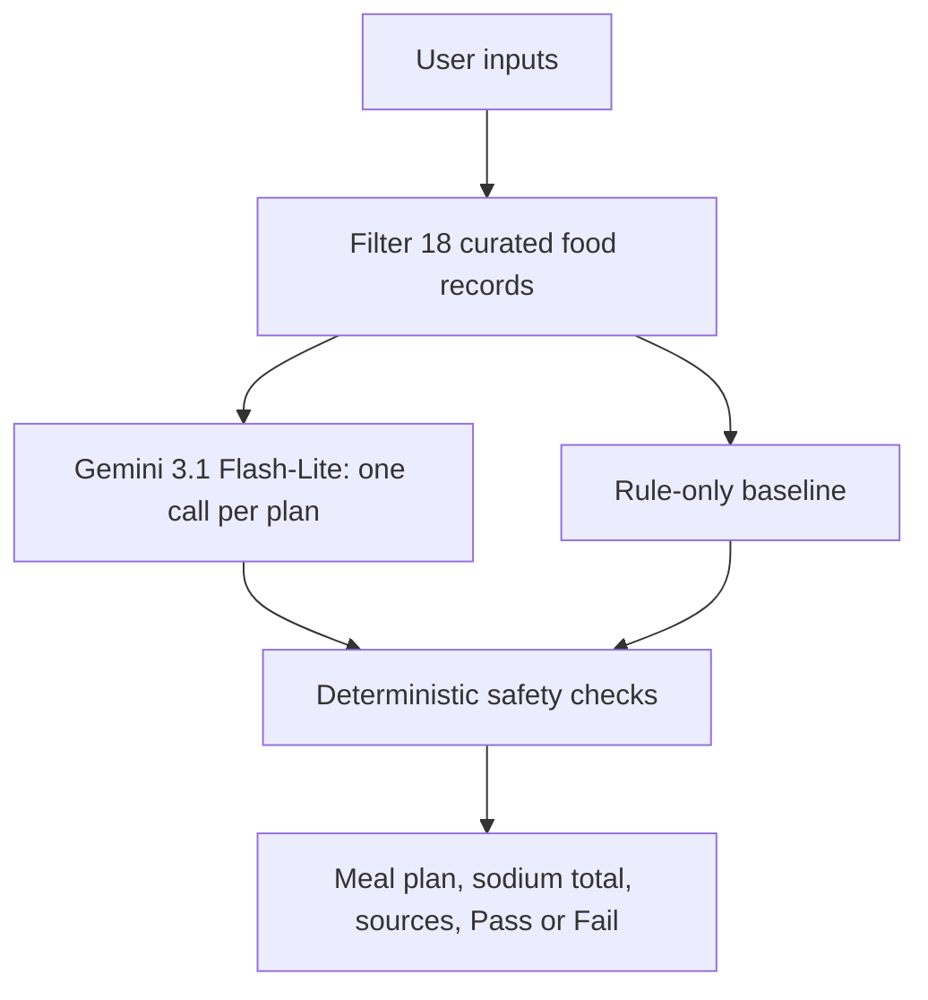

# AI Personalized Nutrition Coach

PE6201 End-of-Course Project

A Streamlit prototype that generates a one-day personalised meal plan. It uses a small curated nutrition set, checks explicit food-avoidance constraints, and estimates whether the total listed daily sodium meets a 2,000 mg target.

## Project purpose

The prototype supports users who want a simple meal plan that reflects their nutrition goal, dietary preference, and foods they want to avoid. It focuses on transparent, constrained meal suggestions rather than clinical nutrition advice.

## Persona

A user who wants one-day meal suggestions based on:

- a nutrition goal;
- a dietary preference; and
- foods they explicitly want to avoid.

## Inputs and outputs

### User inputs

- Nutrition goal: `Lower sodium` or `Balanced everyday meals`
- Dietary preference: `General`, `Vegetarian`, or `Halal`
- Foods to avoid
- Gemini API key, entered at runtime only when using Gemini + retrieval

### Outputs

- Retrieved ingredient-level nutrition facts
- A one-day meal plan
- Estimated total sodium and a Pass/Fail check against 2,000 mg
- Food-level data sources
- Gemini token usage and estimated API cost when Gemini is used

## Product architecture

The current MVP directly filters 18 curated food records stored in `app.py`. It does not use Chroma, a vector database, or an external RAG knowledge base.

The Gemini + retrieval mode first filters the food records according to the user inputs, then asks Gemini to create a plan using only the retrieved food IDs. Deterministic checks calculate sodium and confirm that explicitly avoided foods are excluded.

If Gemini is temporarily unavailable, the app displays a warning and uses the rule-only baseline fallback rather than presenting an unsupported Gemini result.

## Data sources

The curated retrieval set contains 18 ingredient-level foods. Each food record in the app displays its selected serving size and source.

- [SG FoodID — Singapore Food Insights Database (HPB)](https://www.hpb.gov.sg/healthy-living/food-and-beverage/)
- [USDA FoodData Central](https://fdc.nal.usda.gov/)

See [data_sources.md](data_sources.md) for the data approach, food-record scope, and limitations.

## Evaluation

### Metric targeted

The main safety metric is whether the total listed sodium in the one-day meal plan is at or below 2,000 mg. A second check confirms that foods explicitly entered by the user as “foods to avoid” are excluded.

### Evaluation example

Test profile: `Balanced everyday meals`, `General` preference, with `Baked chicken breast` avoided.

| Method | Estimated sodium | Sodium safety check | Avoided food excluded |
|---|---:|---|---|
| Gemini + retrieval | 587.18 mg | Pass | Yes |
| Rule-only baseline | 448.18 mg | Pass | Yes |

Both methods use the same filtered food set. The comparison is therefore between a Gemini-generated plan and a deterministic rule-only plan, rather than between two different nutrition databases.

In one observed Gemini run, Gemini 3.1 Flash-Lite used 356 input tokens, 60 output tokens, and 0 thinking
